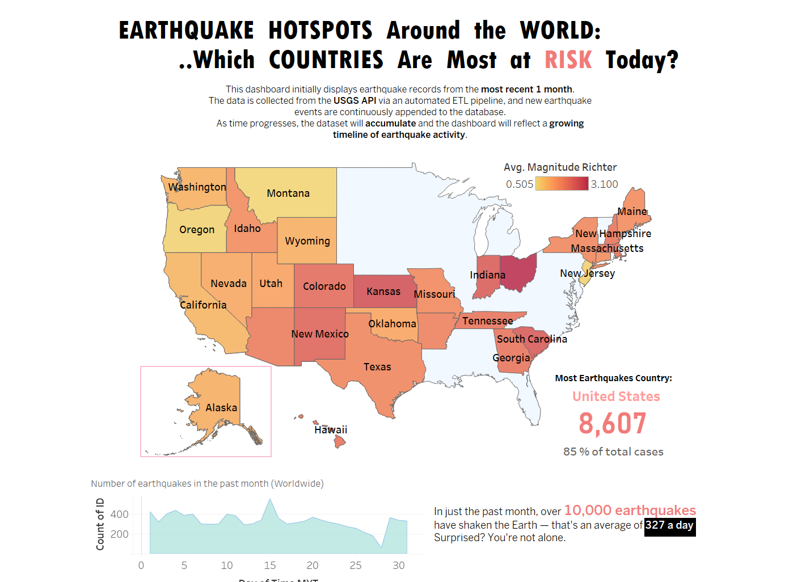
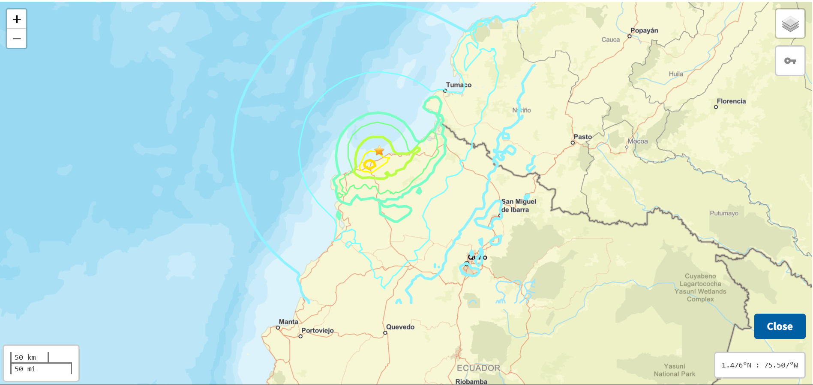
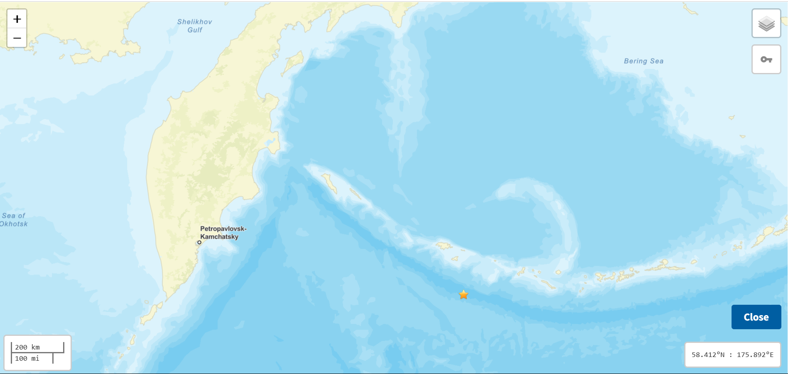
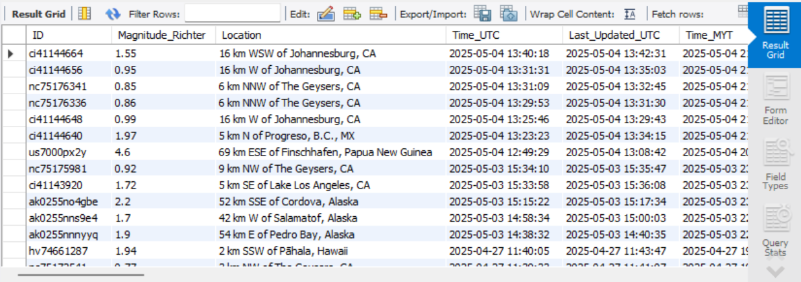
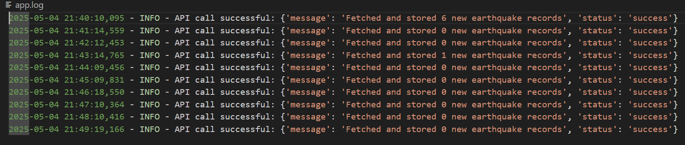

# Near Real-time Earthquake Dashboard with Automated ETL Pipeline

🌎 This project delivers a near real-time dashboard to monitor global earthquakes. The data is extracted from the USGS GeoJSON API, enriched with geolocation details using BigDataCloud’s Reverse Geocoding API, and stored in MySQL. A Flask application automates the pipeline, driven by Windows Task Scheduler every minute. Tableau provides a live, interactive dashboard, refreshed to reveal earthquake patterns in a clear, storytelling format.

🌎 The pipeline starts with the USGS API, fetching fresh earthquake data every minute. BigDataCloud’s reverse geocoding adds details like continent, country, and state. Flask processes and stores the data in MySQL, with Task Scheduler ensuring continuous automation. Logs track pipeline activity for reliable monitoring. The result is a robust dataset, ready for visualization.

🌎 Tableau connects directly to MySQL, transforming data into maps, timelines, and charts. A simple refresh updates the dashboard, presenting insights in a storytelling style. This makes earthquake trends accessible to researchers, officials, or anyone seeking clarity on seismic activity.

[Click here to access full Tableau dashboard](https://public.tableau.com/app/profile/kai.feng.kong/viz/earthquakes_17461967376320/Dashboard3)


*Figure 1: Tableau Dashboard*


*Figure 2: Dashboard enables direct access to USGS web map*


*Figure 3: Another example*

## Project Structure
```
earthquake_project/
│
├── app/                        # Main application logic
│   ├── __init__.py             # Flask app initialization
│   ├── routes.py               # API routes
│   ├── fetch_usgs.py           # USGS data fetching and storage
│   └── db.py                   # Database connection
├── assets/                     # You ignore this
├── logs/
|   └── app.log                 # The file where logs saved
├── scheduler/                  # Scheduling scripts
│   ├── scheduler_call.py       # Script to call API
│   └── run_fetch.bat           # Windows Task Scheduler script
├── .env                        # Environment variables (You create one .env for yourself)
├── .gitignore                  
├── requirements.txt            # Dependencies
├── config.py                   # Configuration
├── run.py                      # Flask app entry point
└── README.md                   
```

## Data Collection via API (Important)

To use the reverse geocoding feature, please sign up for an account at [BigDataCloud Reverse Geocoding](https://www.bigdatacloud.com/reverse-geocoding). After signing up, you will receive an API key. This key is required to access the reverse geocode API.

> ⚠️ Make sure to monitor your usage quota in your BigDataCloud dashboard to avoid exceeding limits (free 50,000 req/month)

I'm using earthquake data from the [USGS Earthquake GeoJSON Feed](https://earthquake.usgs.gov/earthquakes/feed/v1.0/geojson.php). You can explore data feeds API for the following timeframes — each updated every minute:  
- Past Hour
- Past Day
- Past 7 Days
- Past 30 Days

In this project:

Initially, I extract earthquake data from the past 30 days feed to populate the database. All records are stored in MySQL, allowing me to cumulatively build and retain historical data over time. After the initial setup, I switch to using the past hour feed for periodic updates.

This approach is:

✅ More efficient, since the hourly feed contains fewer entries.  
✅ Helps reduce resource usage (bandwidth, processing).  
✅ Prevents re-downloading duplicate data, as we already have past records stored. 

## Setup

Install dependencies:
```pip install -r requirements.txt```

Create a .env file in the project root with the following content:  
```
BIGDATACLOUD_API_KEY = your_bigdatacloud_api_key  
MYSQL_USER = your_mysql_user  
MYSQL_PASSWORD = your_mysql_password  
MYSQL_HOST = localhost  
MYSQL_PORT = 3306  
MYSQL_DATABASE = earthquake_db
```  
Replace `your_bigdatacloud_api_key`, `your_mysql_user`, and `your_mysql_password` with your actual values.

Ensure MySQL is running and the credentials in .env are correct.

Run the Flask app:
```python run.py```

Schedule periodic data fetching using Windows Task Scheduler:

Create a task to run scheduler/run_fetch.bat  

Set desired frequency (e.g., minutely)

## API Endpoints

GET /fetch-data: Fetches latest USGS earthquake data and stores it in MySQL

## Tableau Connection

Use MySQL connector in Tableau Desktop

Connect to:  
**Host:** Use the value from MYSQL_HOST in .env (e.g., localhost)  
**Port:** Use the value from MYSQL_PORT in .env (e.g., 3306)  
**Database:** Use the value from MYSQL_DATABASE in .env (e.g., earthquake_db)  
**Username:** Use the value from MYSQL_USER in .env  
**Password:** Use the value from MYSQL_PASSWORD in .env

Select the *earthquakes* db table for live data connection (in Tableau data source tab)

## Notes

The application uses *BigDataCloud API* for reverse geocoding  
Data is stored in the *earthquakes* db table with comprehensive fields  
Logging is implemented for monitoring and debugging  
Use *Tableau Desktop* instead of *Tableau Public* (the public version is restricted to access database)  
You're not neccessary must use *MySQL Workbench*, it's just a GUI database management tool, you can use others


*Figure 4: MySQL Workbench*


*Figure 5: Logging*
